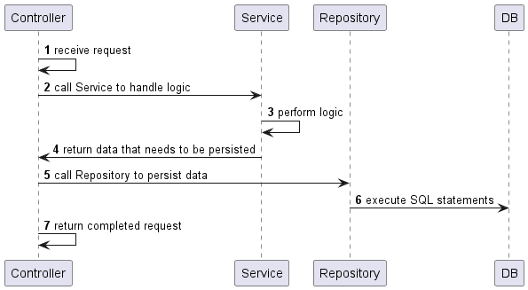
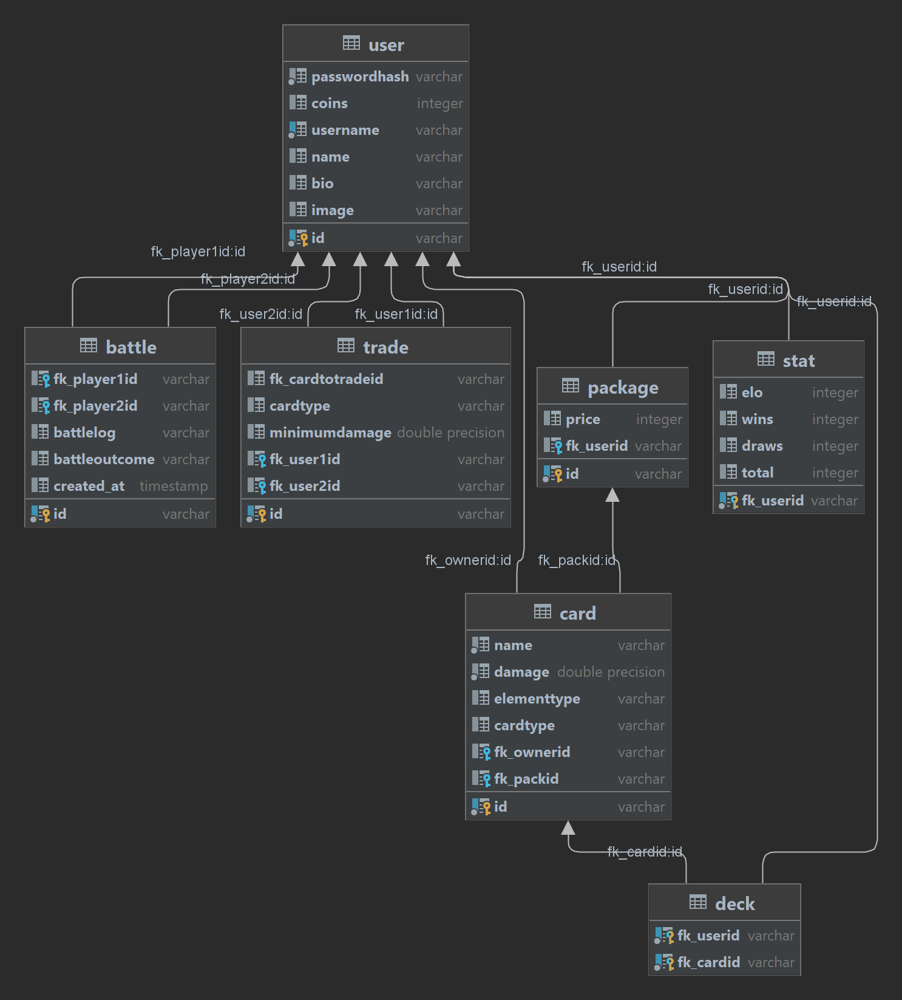

# Setup

```bash
# Start the container
docker-compose up -d

# Create the db mtcg
docker exec <CONTAINER-ID> createdb -U josip mtcg

# Run the init.sql script to create the tables (or restore the dump)
docker exec -i <CONTAINER-ID> psql -U josip -d mtcg < init.sql

# To create a dump
docker exec <CONTAINER-ID> pg_dump -U josip mtcg > dump.sql
```

# Design

The app is a multithreaded REST server that makes use of a service pattern. The business logic is contained within the
service layer. When a new request comes in the respective controller will make a call to the respective service.
This architecture enabled me to easily write unit tests.

As for persisting the data I used a postgres DB that runs in a docker container. Repositories take care of storing the
actual data.
After the service handled the action the user requested the controller makes a call to the respective repository.
Repositories simply take the data of services as is and insert them (with prepared statements). I did not
want to couple the database and the actual business logic hence why I chose this approach. The data from the database is
loaded into the business layer once when the server is started.





# Lessons learned

Synchronizing the access to the data and making the SQL transactions atomic were a nice insight.
Moreover, I created my own ConnectionPool to not have to lock the same database connection all the time.
The separate threads can simply call `connectionPool.getConnection()` to obtain a lock on a connection from the pool.

# Unit testing decisions

Since all the logic is contained within the services that are called by the controllers I created test cases for each
controller. The tests have a code coverage of roughly 70% of the relevant business logic.
I used Mockito to mock the repositories to ensure they will not accidentally interact with my database.
I also used Mockito to mock a `java.util.Random` object with a fixed seed to ensure the battle logic is tested in a
deterministic manner.

# Time & Git Link

I spent roughly 80 hours on [this project](https://github.com/JosipDomazetDev/MTCG).

# Unique feature

| Monster | Crit Chance |
|---------|-------------|
| dragon  | 1%          |
| goblin  | 40%         |
| knight  | 20%         |
| kraken  | 10%         |
| other   | 5%          |

"Critical Strikes" is a mechanic that only comes into effect in pure monster battles.
A critical strike increase the damage dealt by 50%.
The battle log uses a "!" character to indicate critical strikes.

> admin's "Ork" [83!] WINS against kienboec's "Dragon" [55]

The crit damage calculation is applied at the very end. Meaning a dragon with a strength of 70 that fights a WATER
monster might even reach a strength of 210 if he lands a critical strike.

| Monster | Dodge Chance |
|---------|--------------|
| dragon  | 10%          |
| goblin  | 10%          |
| elf     | 30%          |
| other   | 5%           |

"Dodge" is a mechanic that only comes into effect in pure monster battles.
If a monster is about to lose a round, they might be able to dodge in time if they are lucky.
In this case the round ends in a draw.
The battle log reflects whether a dodge occurred.

> admin's "WaterGoblin" [15] DRAWS against kienboec's "Ork" [55] by narrowly escaping the attack

## Bonus Features

### ConnectionPool

The `connectionPool` can execute statements in an atomic manner and provides an easy-to-use API, e.g.:

```java
getConnectionPool().executeAtomicTransaction((connection)->{
    try(
        PreparedStatement psUser=createInsertUserStatement(user,connection);
        PreparedStatement psStat=createInsertStatStatement(user,connection)
    ){
        psUser.execute();
        psStat.execute();
    }catch(SQLException e){
        e.printStackTrace();
    }
});
```

The SQL statements `psUser` and `psStat` will either be both executed or neither of them.

### Win/Loose Ration & Additional Routes

The user can look at this win rate.

```json
{
  "elo": 103,
  "wins": 1,
  "draws": 1,
  "name": "Kienboeck",
  "losses": 0,
  "winRate": "50%"
}
```

Furthermore, the user can use the path `GET /cards/{card-id}` to look at the details of just one card. He can also look at
the trades that belong to him with `GET /tradings?belongs=me`.
